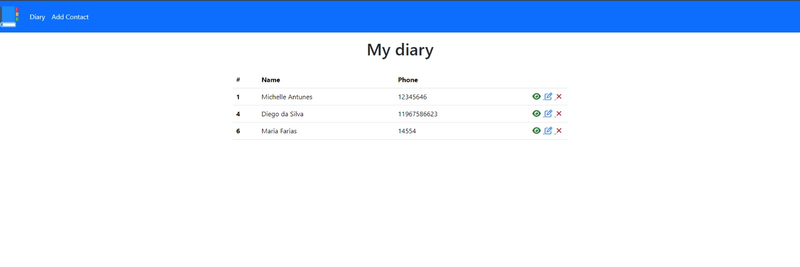

## My Diary

### A platform developed to be an online contact diary.

<h1 align="center">
    
</h1>

## Table of Contents::

- <a href="#Objective"> Objective </a>
- <a href="#Technologies Used"> Technologies Used </a>
- <a href="#Authorship"> Authorship </a>
- <a href="#ProjectStatus"> Project Status </a>

## Objective

An online work platform proposed by the course taken by Matheus Battisti with the aim of uniting basic PHP knowledge on both the front and back end.

It's important to note that stylisation was not the main objective of this project, but rather CRUD functionalities.

## Technologies Used

### Front-End:

1. [PHP](https://www.php.net/)
2. [Bootstrap](<https://en.wikipedia.org/wiki/Bootstrap_(front-end_framework)>)
3. [CSS](https://developer.mozilla.org/en-US/docs/Web/CSS)
4. [AWESOME](https://fontawesome.com/)

### Authorship

Michelle Antunes, Abril/2024.
 

<kbd>[Linkedin](www.linkedin.com/in/michelle-antunes-868b24156)</kbd>
 
Email: miichelleantunes@outlook.com

### Project Status

Completed! =)
